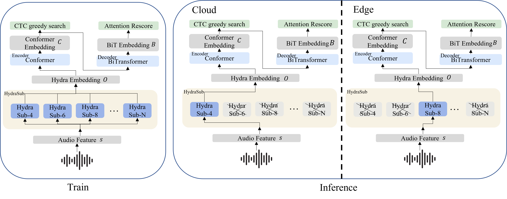

# Hydraformer


*Figure 1:Comparison of HydraFormer and single subsampling rate ASR models

HydraFormer, comprising HydraSub, a Conformer-based encoder, and a BiTransformer-based decoder. HydraSub encompasses multiple branches, each representing a distinct subsampling rate, allowing for the flexible selection of any branch during inference based on the specific use case. HydraFormer can efficiently **manage different subsampling rates**, significantly reducing training and deployment expenses. 
## Introduction
This repo is the code of **HydraFormer: One Encoder For All Subsampling Rates** which submitted to ICME2024. The code is based on [wenet](https://github.com/wenet-e2e/wenet), and we will release all the code and checkpoint after the paper is accepted.

Hydraformer may contain multiple subsampling rates, in this repo, we set the subsampling rate to 4,6,8. You may add the subsampling rate numbers freely.


To ensure the reproducibility of the experiment, we provide the config file of our experiments in the 'config' folder. Each experiment corresponds to a config file, such as 'aishell_hydraformer_468_nopos' means the experiment is trained on the AISHELL dataset, and the subsampling rate is 4,6,8, and the positional encoding is not used.

We will make the checkpoint of our experiments public after the paper is accepted. As the checkpoint is too large, we will upload it to the Baidu Netdisk and Google Drive. You can download it from the following links freely. Due to the double-blind review, the link is hidden because it contains the author's name. We will make it public after the paper is accepted.

## Training and Inference examples of HydraFormer

*Figure 2: Comparison of training and inference examples of HydraFormer in the cloud and edge scenarios.  designates branches that are in an active or engaged state during training and inference steps.

For example, consider a hybrid cloud-edge system. The cloud ASR model is trained with a subsampling rate of 4, as accuracy is the paramount metric in the cloud scenario. Meanwhile, the edge ASR model is trained with a subsampling rate of 8, with speed as the primary concern. The edge side is responsible for quickly generating results, tolerating certain errors, as the final outcomes will be replaced by the more accurate results from the cloud. Traditionally, this would require training two independent models, doubling the training cost. By employing HydraFormer, one can configure HydraSub as a combination of subsampling rates 4 and 8. In this setup, a single model can **adapt to both cloud and edge scenarios**, effectively reducing the training cost by **50%** compared to the conventional approach.

In the train stage, we use **all the hydrasub** branches to train the model. Specifically, in every training step, we randomly select one of the HydraSub branches, denoted as HydraSub-n, such as Hydrasub-4. To ensure consistent performance across all branches, we implement a balanced training process where each branch is randomly selected through a uniform distribution, guaranteeing that every branch receives equal training opportunities.

In the inference stage, if in the cloud scenario, we **only use the HydraSub-4 branch** to inference. We do not use the HydraSub-6, HydraSub-8 or other branches for gain a better recognition accuracy.
If in the edge scenario, we **only use the HydraSub-8 branch** to inference, as the inference speed is the paramount metric in the edge scenario. We do not use the HydraSub-4, HydraSub-6 or other branches for gain a better inference speed.

## More details about experiments

Comparison of HydraFormer's size and single subsampling rate ASR models' size(M) 
|             | **Encoder** | **Decoder** | **Subsampling part** | **All** |
| ----------- | ----------- | ----------- | -------------------- | ------- |
| Baseline 1/4sub   | 31.6        | 13.8        | 1.8                  | 48.3    |
| Baseline 1/6sub   | 31.6        | 13.8        | 2.4                  | 48.9    |
| Baseline 1/8sub   | 31.6        | 13.8        | 1.7                  | 48.3    |
| HydraFormer | 31.6        | 13.8        | 6.0                  | 51.7    |


To clarify, HydraFormer consists of a Conformer-based encoder, a Bi-Transformer-based decoder, and HydraSub. It has 51.7M parameters in total, with 31.6M for the encoder, 13.8M for the decoder, and 6.0M for HydraSub.

The baseline models feature the same Conformer-based encoder and Bi-Transformer-based decoder, totaling 48M parameters, with 31.6M for the Conformer-based encoder and 13.8M for the Bi-Transformer-based decoder. The **only 3M difference lies in the subsampling component**. This minor difference results in a negligible increase in training cost for HydraFormer compared to a single-subsampling-rate model. However, HydraFormer can achieve performance nearly on par with multiple single-subsampling-rate models.

## Installation

- Clone the repo
``` sh
git clone https://github.com/HydraFormer/hydraformer.git
```

- Install Conda: please see https://docs.conda.io/en/latest/miniconda.html
- Create Conda env:

``` sh
conda create -n wenet python=3.8
conda activate wenet
pip install -r requirements.txt
```

## Config
It is very important to set the config file correctly. We provide the config file of our experiments in the 'config' folder. Each experiment corresponds to a config file, such as 'aishell_hydraformer_468_nopos' means the experiment is trained on the AISHELL dataset, and the subsampling rate is 4,6,8, and the positional encoding is not used. While 'aishell_4' means the experiment is trained on the AISHELL dataset, and the subsampling rate is 4, and the positional encoding is not used.

In the training and testing stage, you need to modify the config file path in the 'run.sh' file to run the experiment.

## Data Preparation
We use the AISHELL and LibriSpeech dataset in our experiments. As the dataset is large, we do not upload it to the repo. You can download it following the script.

For AISHELL dataset, please dive into the aishell folder
```
cd examples/aishell/s0
# stage -1 means download the dataset
bash run.sh --stage -1 --stop_stage 3
```

For LibriSpeech dataset, please dive into the librispeech folder
```
cd examples/librispeech/s0
# stage -1 means download the dataset
bash run.sh --stage -1 --stop_stage 3
```


## Train
We train our experiments on two datasets, which is AISHELL and LibriSpeech. 
Each experiment corresponds to a config file.You need to modify the config file path in the 'run.sh' file to run the experiment.

You may freely adjust the parameters in the `run.sh`, such as the number of GPUs, the number of epochs, the number of checkpoints to save, and so on.


For AISHELL dataset, please dive into the aishell folder
```
cd examples/aishell/s0
bash run.sh --stage 4 --stop_stage 4
```

For LibriSpeech dataset, please dive into the librispeech folder
```
cd examples/librispeech/s0
bash run.sh --stage 0 --stop_stage 4
```

## Test the WER
We test our experiments on two datasets, which is AISHELL and LibriSpeech.

We test in two different way, which is streaming and non-streaming. As for the streaming test, please set the chunk size to 16 if the subsampling rate is 4, and set the chunk size to 11 if the subsampling rate is 6, and set the chunk size to 8 if the subsampling rate is 8. As for the non-streaming test, please set the chunk size to -1.

We use the model averaged on 30 epochs to test the WER.

For AISHELL dataset, please dive into the aishell folder
```
cd examples/aishell/s0
bash run.sh --stage 5 --stop_stage 5
```

For LibriSpeech dataset, please dive into the librispeech folder
```
cd examples/librispeech/s0
bash run.sh --stage 5 --stop_stage 5
```

## Test the latency(RTF)
We test the latency of hydraformer on different subsampling rates on AISHELL dataset.

for the streaming test, please dive into the aishell folder
```
cd examples/aishell/s0  

bash run.sh --stage 6 --stop_stage 7
```

## Visualization
We visualize the weights of the encoder on different subsampling rates on AISHELL dataset.

Specifically, we visualize the weights of the encoder on different models, which is the HydraFormer and the three baseline models, which is trained on the subsampling rate of 4,6,8 respectively.

```
for i in range(12):
    layer_name1 = f"encoder.encoders.{i}.conv_module.pointwise_conv1.weight"
    layer_name2 = f"encoder.encoders.{i}.feed_forward.w_1.weight"
```
We select two layers of the encoder, which is the pointwise_conv1 and the feed_forward.w_1. We calculate all the 12 layers of the encoder.

Please dive into the visualization folder and find more details.
```
cd visualization
python fig.py
```

## Training details
We train the model using 8 V100 GPUs with 40G memory each. The training configuration consists of a static batch type with a batch size of 16 and a maximum of 12,000 frames per batch. The gradient is clipped at 5. The model configuration includes a CTC weight of 0.3, no length normalization for the loss, an LSM weight of 0.1, and a reverse weight of 0.3. We use the Adam optimizer with a learning rate of 0.001. The scheduler employed is the warmup learning rate scheduler, with a warmup step of 25,000.